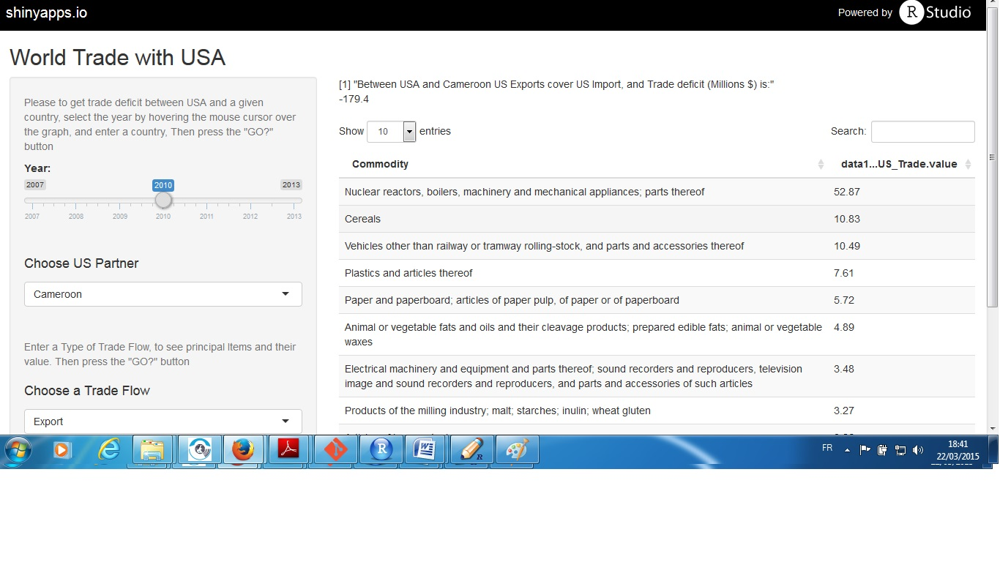
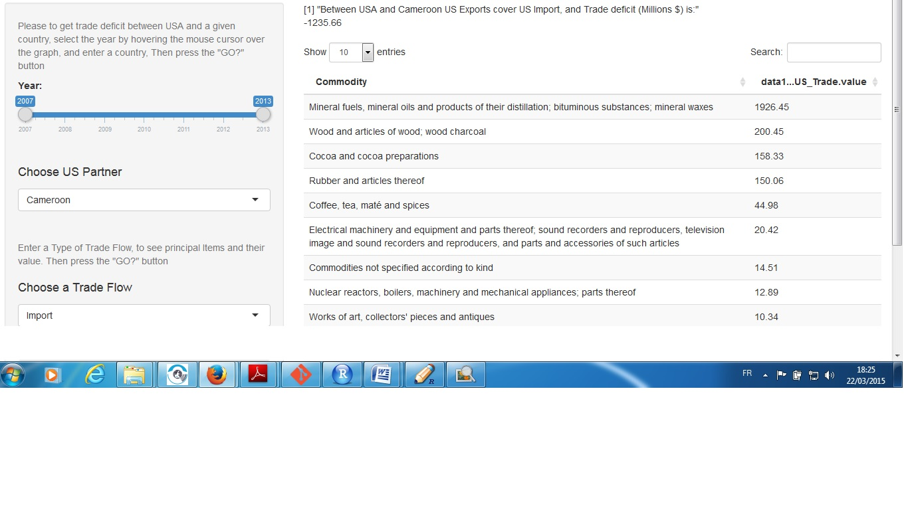

<!-- to publish run
setwd("C:/Data_Scientist/Cours/Developing_Data_Products/UN_COMTRADE/Slide_r")
library(slidify)
author("UN_Project")
publish('UN_Project', 'memed01')
-->

## EXECUTIVE SUMMARY

### Welcome!

> My name is Georges, I'm a Data Scientist student at Coursera, I was born in Yaoundé Cameroon in Africa, but I live now in Montréal Canada.
> * This project launches a quick glance at the US International Trade.
> * For many countries and businessmen have access to the value of trade between a country and the United States, may have advantages in the development of business strategy. 
> * This simple app provides an unique opportunity for the viewers to search for historical trade deficit/surplus between USA and a given country, from 2007 till 2013. 
> * Searched information deficit/surplus are displayed by selecting the year by hovering the mouse cursor over the graph
> * Principal products and their value are summarized in table output format under 'Data' tab.

**(Data source: United Nation COMTRADE Database http://comtrade.un.org/data/)**

## Slidify

> * These slides were made using an R package called [Slidify](http://slidify.org/index.html).
> * All the slides and the output are generated by R; it's like embedding analysis code in PowerPoint but also having PowerPoint perform the analysis.
> * These slides can be viewed at <http://rpubs.com/memed/130555>

---

## To view Trade Deficit/Surplus Between USA and a country

You first have to choose the year by hovering the mouse cursor, then you choose a country:
 

---

## To view the main products imported by USA in a country

You first have to choose the year by hovering the mouse cursor, then you choose a country, and a Trade Flow="Import":
 

---

## To view the main products exported by USA in a country

You first have to choose the year by hovering the mouse cursor, then you choose a country, and a Trade Flow="Export":

You can make the same thing with Re-exportations, to view main item which are rexportated in USA.

